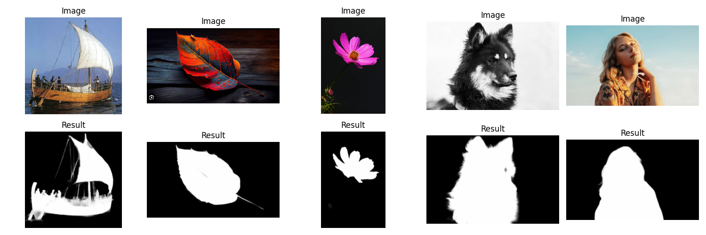

<p align="center">  
  <h1 align="center">U<sup>2</sup>-Net: U Square Net</h1>
  
</p>

## U<sup>2</sup>-Net: Going Deeper with Nested U-Structure for Salient Object Detection

### Structure

- `nn.py`: Defines the U<sup>2</sup>-Net neural network architecture.
- `util.py`: Contains utility functions and classes.
- `datasets.py`: Handles data loading, preprocessing, and augmentation.
- `main.py`: The main executable script that sets up the model, performs training,testing, and inference(Video && Image).

### Installation

```
conda create -n PyTorch python=3.9
conda activate PyTorch
conda install pytorch torchvision torchaudio pytorch-cuda=11.8 -c pytorch -c nvidia
pip install opencv-python==4.5.5.64
pip install scipy
pip install tqdm
pip install timm
```

### Dataset Preparation

- `Download datasets:` SOD, ECSSD, DUT-OMRON, PASCAL-S, HKU-IS and DUTS-TE.

### Train

* Configure your dataset path in `main.py` for training
* Run `python main.py --train` for Single-GPU training
* Run `bash main.sh $ --train` for Multi-GPU training, `$` is number of GPUs

### Test

* Configure your dataset path in `main.py` for testing
* Run `python main.py --test` for testing

### Pretrained weight:
saved in `weights` folder

### Demo

* Configure your video path in `main.py` for visualizing the demo
* Run `python main.py --demo` for demo

### Demo with image

* Configure your image path in `main.py` for visualizing the demo image
* Run `python main.py --demo_image` for demo

#### Reference
* https://github.com/xuebinqin/U-2-Net/tree/master
